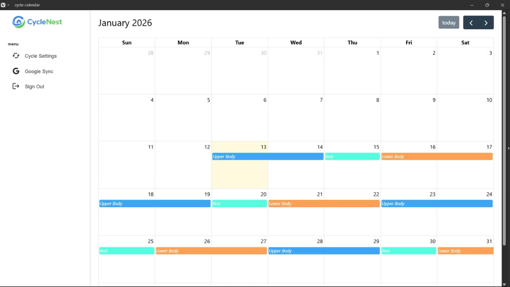
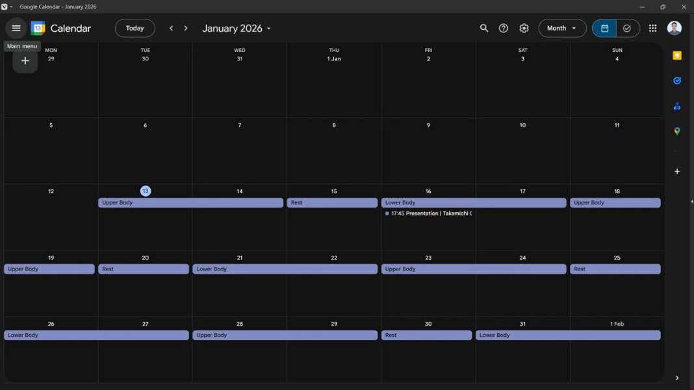

<p align="center">
  
</p>

<h1 align="center">CycleNest</h1>

<p align="center">
  Build recurring routines in seconds — create a cycle once, generate events, and sync to Google Calendar.
</p>

<p align="center">
  <a href="#getting-started">Getting Started</a> ·
  <a href="#features">Features</a> ·
  <a href="#tech-stack">Tech Stack</a>
</p>

## Demo / Screenshots

**Demo video:** [_Youtube Link_ ](https://youtu.be/kSNAdIRxqPs?si=7NgWnh5ZNI7jokTi)

### Screenshots





## Features

- **Cycle builder:** Create a cycle by stacking items (title, duration in days, and color).
- **Repeat generation:** Generate the cycle **N times** from a chosen start date.
- **Persistent cycles:** Save cycles to the database and fetch them after login.
- **Calendar view:** Render generated events in a monthly calendar.
- **Google Calendar sync:** Push generated events to Google Calendar.
- **Auth-protected routes:** Only logged-in users can access the app pages.

## Tech Stack

### Frontend

- **React** (UI)
- **Vite** (dev server & build)
- **FullCalendar** (calendar UI)
- **MUI** (dialogs, form inputs, buttons)
- **Tailwind CSS** (layout & styling)

### Backend

- **Node.js + Express** (REST API)
- **MongoDB + Mongoose** (data persistence)
- **googleapis** (Google Calendar API integration)

## Getting Started

### Prerequisites

- **Node.js** (LTS recommended)
- **MongoDB** (local instance or MongoDB Atlas)

### Installation

```bash
git clone <YOUR_REPO_URL>
cd <YOUR_REPO_NAME>
npm install
```

```bash
cd server
npm install
```

### Environment Variables

#### Backend (`/server/.env`)

Create a `.env` file inside the `server` folder:

```env
SERVER_PORT=3000
SECRET=your_session_secret
DB_URI=your_mongodb_connection_string
```

- `SERVER_PORT`: Use `3000` (or any port you prefer).
- `SECRET`: Use a long random string. You can generate one with Node:

```bash
node -e "console.log(require('crypto').randomBytes(32).toString('hex'))"
```

#### Frontend (project root `.env`)

Create a `.env` file at the project root:

```env
VITE_GOOGLE_ACCESS_TOKEN=your_google_access_token
VITE_CALENDAR_ID=your_calendar_id
```

- `VITE_GOOGLE_ACCESS_TOKEN`: You can generate an access token using Google Developers [_OAuth 2.0 Playground_](https://developers.google.com/oauthplayground)

1. Open OAuth 2.0 Playground

1. In Step 1: Select & authorize APIs, choose Google Calendar API v3

1. Select these scopes:
   - `.../auth/calendar`

   - `.../auth/calendar.events`

1. Authorize and generate the access token, then paste it into `VITE_GOOGLE_ACCESS_TOKEN`.

- `VITE_CALENDAR_ID`: Your Google Calendar ID (usually your Google account email address).

### Run Locally

#### Start the frontend

```bash
npm run dev
```

#### Start the backend

```bash
cd server
node index.js
```

### Local URLs

- Frontend: `http://localhost:5173`
- Backend: `http://localhost:3000`

## Roadmap / Remaining Tasks

- [ ] **Generate OAuth token from user flow**
- [ ] **Notifications feature**
- [ ] **Reorder items while building a cycle**
- [ ] **Edit existing cycles**
- [ ] **Delete cycles**
- [ ] **Add input validation**
- [ ] **Logout functionality**
- [ ] **Prevent duplicate Google events (UID)**
- [ ] **UI improvements**
- [ ] **Dark mode**

## License

MIT
